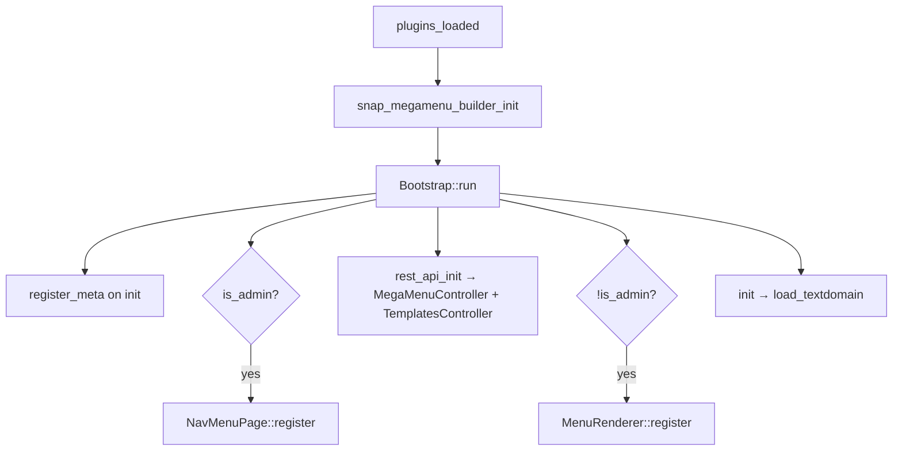

# Architecture — Snap Mega Menu Builder

Agent briefing (concise): [`../AGENTS.md`](../AGENTS.md).

## Purpose

Extend WordPress **Appearance → Menus** with a per-item mega menu builder. Editors design panel content in an isolated Gutenberg editor; the front end renders that content in a dropdown panel attached to top-level nav items.

## Bootstrap sequence



Entry: `snap-megamenu-builder.php` defines constants, loads Composer autoload, instantiates `Snap\MegaMenuBuilder\Core\Bootstrap`.

## Post meta schema

Registered on `init` for object subtype `nav_menu_item`:

| Meta key | Type | Default | Notes |
|----------|------|---------|-------|
| `_snap_megamenu_enabled` | boolean | `false` | Master switch |
| `_snap_megamenu_settings` | string | `'{}'` | JSON: `width`, `customWidth`, `bgColor`, `animation` |
| `_snap_megamenu_content` | string | `''` | Serialized block markup |

All three expose `show_in_rest` and require `edit_theme_options` via `auth_callback`.

**Legacy reads:** `MetaKeys::get()` falls back to `_jemented_megamenu_*` when new keys are empty.

## Admin layer

### Asset loading (`NavMenuPage`)

Only on `nav-menus.php`:

1. `wp_enqueue_media()` for image blocks.
2. Block editor dependency styles (`wp-edit-blocks`, `wp-components`, etc.).
3. Plugin bundle: `build/index.js` + `build/index.css` (from `@wordpress/scripts`).
4. `wp_localize_script` → `snapMegaMenu`: REST base URL, `wp_rest` nonce.

### React mount

- Mount point: `<div id="snap-megamenu-root">` printed in `admin_footer`.
- App watches `#menu-to-edit` for depth-0 items and injects `.snap-megamenu-btn` links into `.menu-item-actions`.
- Click opens `MegaMenuModal` for that menu item ID.

### Isolated block editor

`IsolatedEditor` creates a mini editor:

- `BlockEditorProvider` + `BlockList` + `BlockInspector` + `BlockToolbar`
- `allowedBlockTypes` from `getAllowedBlocks()` — see [Allowed blocks](#allowed-blocks) below
- `mediaUpload` wired to `wp.media` frame
- Content serialized with `@wordpress/blocks` `serialize()` / `parse()`
- Undo/redo via `useStateWithHistory` (`EditorUndoRedo`)

Core blocks registered via `registerCoreBlocks()` in `index.js`.

## Allowed blocks

The Content Builder uses a curated allowlist (not the full site editor). Defaults live in `includes/Core/AllowedBlocks.php` and are passed to JS as `window.snapMegaMenu.allowedBlocks`.

| Category | Block names |
|----------|-------------|
| Layout | `core/columns`, `core/column`, `core/group`, `core/row`, `core/stack` |
| Content | `core/heading`, `core/paragraph`, `core/list`, `core/list-item`, `core/image`, `core/buttons`, `core/button`, `core/separator`, `core/spacer` |
| Navigation | `core/page-list`, `snap-megamenu/link-item` |
| Media | `core/cover` |
| Embeds / widgets | `core/shortcode`, `core/html` |

Third-party blocks must be **registered** (e.g. via `register_block_type`) before they appear in the inserter.

### Extending the allowlist

**PHP (recommended)** — filter `snap_megamenu_allowed_blocks`:

```php
add_filter( 'snap_megamenu_allowed_blocks', function ( array $blocks ): array {
    $blocks[] = 'my-plugin/featured-card';
    return $blocks;
} );
```

**JavaScript** — filter `snap-megamenu.allowedBlocks` (admin only, after `@wordpress/hooks` is available):

```js
import { addFilter } from '@wordpress/hooks';

addFilter(
    'snap-megamenu.allowedBlocks',
    'my-plugin/add-blocks',
    ( blocks ) => [ ...blocks, 'my-plugin/featured-card' ]
);
```

Use the PHP filter when both server and client need the same list; use the JS filter for admin-only adjustments.

## REST layer

```
GET  /wp-json/snap-megamenu/v1/item/{id}
POST /wp-json/snap-megamenu/v1/item/{id}
GET  /wp-json/snap-megamenu/v1/templates
GET  /wp-json/snap-megamenu/v1/templates/{slug}
```

**GET item response:**

```json
{
  "id": 123,
  "enabled": true,
  "settings": { "width": "full", "customWidth": 1200, "bgColor": "", "animation": "fade" },
  "content": "<!-- wp:columns -->..."
}
```

**POST body:** same shape; content sanitized via `BlockContentSanitizer`.

## Frontend layer

### Walker injection (`MenuRenderer::override_walker`)

```php
apply_filters( 'snap_megamenu_locations', [ 'primary', 'main-menu', 'header' ] )
```

When `wp_nav_menu()` uses a matching `theme_location`, `MegaMenuWalker` replaces the default walker.

### Panel HTML (`MegaMenuPanelRenderer::append`)

For enabled depth-0 items with content:

```html
<div class="snap-megamenu-mega-panel" data-animation="fade" style="..." role="region" aria-label="...">
  <div class="snap-megamenu-mega-panel__inner">
    <!-- block content via the_content filter -->
  </div>
</div>
```

Inline styles from settings: `width` (`full` | `container` | `custom`), `bgColor`.

### CSS classes

`MenuRenderer::add_mega_menu_class` adds `has-mega-menu` to enabled depth-0 `<li>` elements.

### Frontend JS (`assets/js/frontend.js`)

- Selectors: `.has-mega-menu`, `.snap-megamenu-mega-panel`
- Toggle class `is-open` on click/Enter/Space
- ARIA: `aria-haspopup`, `aria-expanded`, `aria-controls`
- Escape and outside-click close all panels
- Hover/focus-within also open panels (CSS-driven)

### Frontend CSS (`assets/css/frontend.css`)

Theme-overridable custom properties (`--snap-megamenu-mega-*`). Hides default `.sub-menu` under mega items. Responsive: static positioning below 768px.

## Build pipeline

| Tool | Config | Output |
|------|--------|--------|
| `@wordpress/scripts` | default (entry: `src/index.js`) | `build/index.js`, `build/index.css`, `build/index.asset.php` |
| Composer PSR-4 | `composer.json` | `vendor/autoload.php` → `Snap\MegaMenuBuilder\` |

Admin CSS is imported from `src/index.js` → bundled into `build/index.css`.

Frontend `assets/` are **not** processed by wp-scripts — edit directly.

## Extensibility hooks

| Hook | Type | Purpose |
|------|------|---------|
| `snap_megamenu_locations` | filter | Theme menu location slugs that use `MegaMenuWalker` |
| `snap_megamenu_apply_walker` | filter | Override walker application decision |
| `snap_megamenu_template_directories` | filter | Add template scan directories |
| `snap_megamenu_templates` | filter | Filter template list for admin UI |
| `snap_megamenu_template_data` | filter | Filter single template before REST response |
| `snap_megamenu_allowed_blocks` | filter | Block names allowed in the Content Builder |

## Integration with Nextora theme

If the theme registers a nav menu location other than `primary`, `main-menu`, or `header`, add it via:

```php
add_filter( 'snap_megamenu_locations', function ( $locations ) {
    $locations[] = 'your-theme-location';
    return $locations;
} );
```

Theme can override panel appearance via CSS targeting `.snap-megamenu-mega-panel` or redefining `--snap-megamenu-mega-*` variables.

## Directory map

```
snap-megamenu-builder/
├── snap-megamenu-builder.php    Plugin bootstrap
├── includes/
│   ├── Core/Bootstrap.php
│   ├── Core/MetaKeys.php
│   ├── Admin/NavMenuPage.php
│   ├── Rest/MegaMenuController.php
│   ├── Rest/TemplatesController.php
│   ├── Templates/TemplateRepository.php
│   └── Frontend/
│       ├── MenuRenderer.php
│       ├── MegaMenuWalker.php
│       └── MegaMenuPanelRenderer.php
├── src/                        Admin React source
├── build/                      Compiled admin assets
├── assets/                     Frontend CSS/JS
├── templates/                  Built-in JSON templates
├── tests/php/                  PHPUnit bootstrap
├── AGENTS.md                   Agent briefing
└── docs/AGENT.md               This file
```
